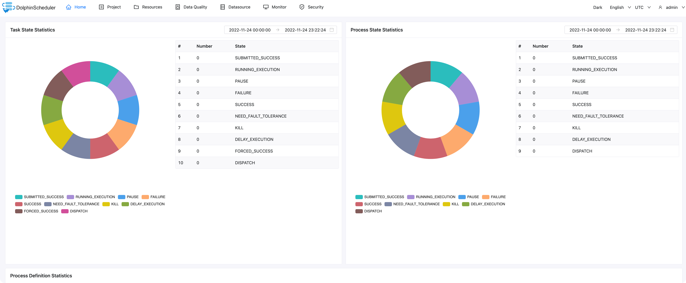
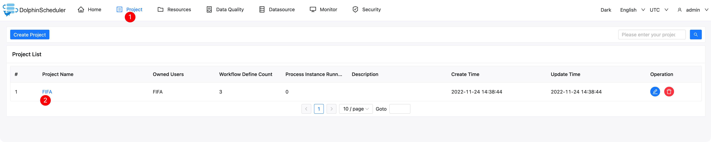
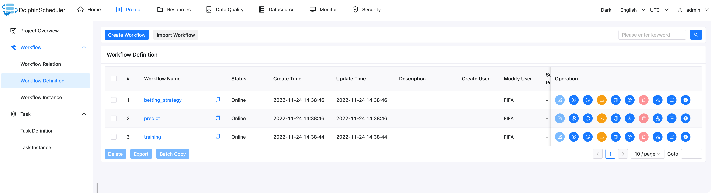
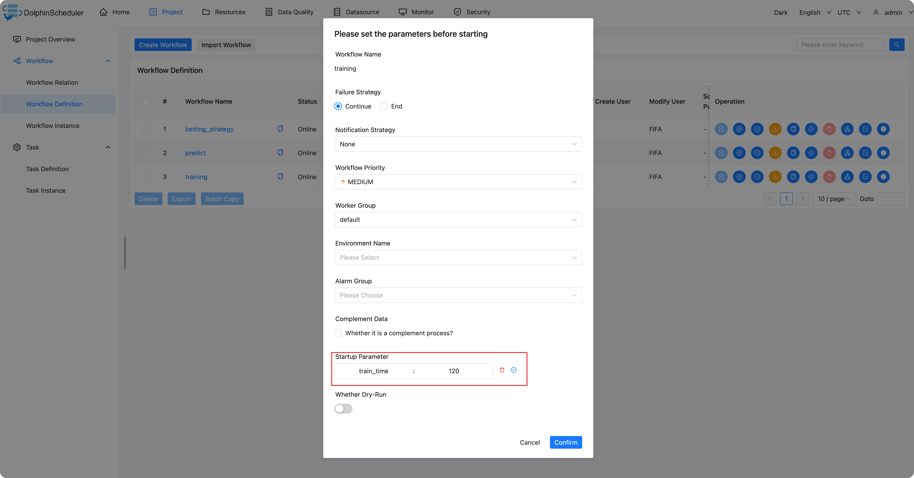
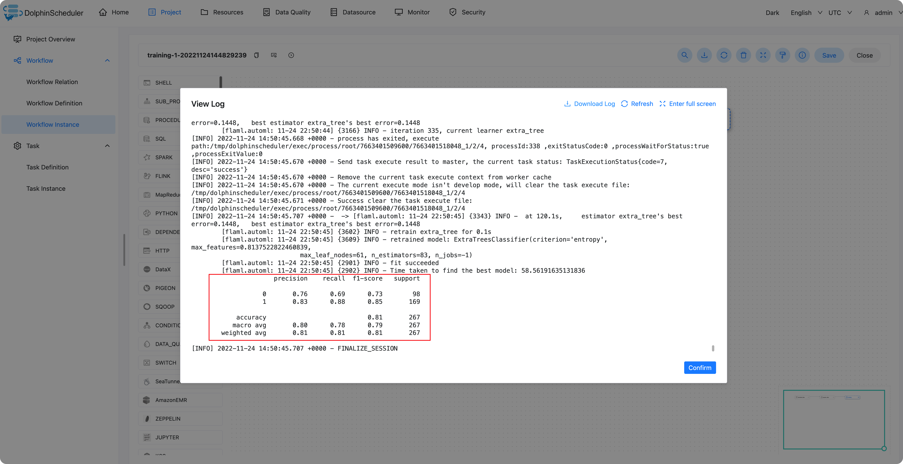
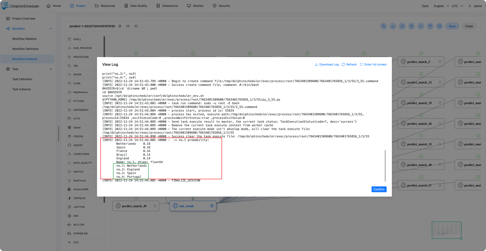
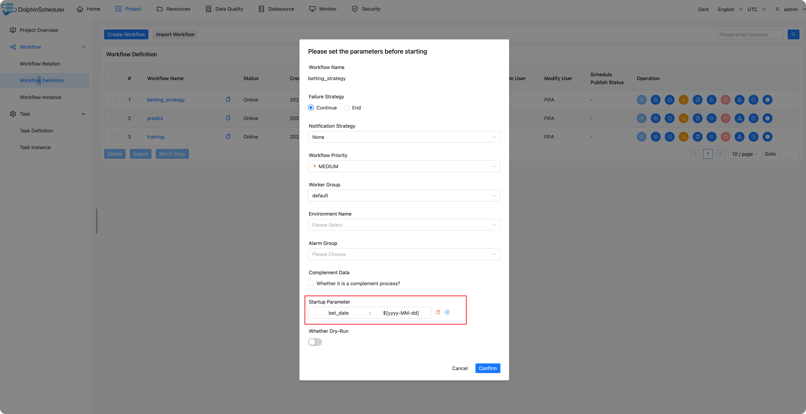
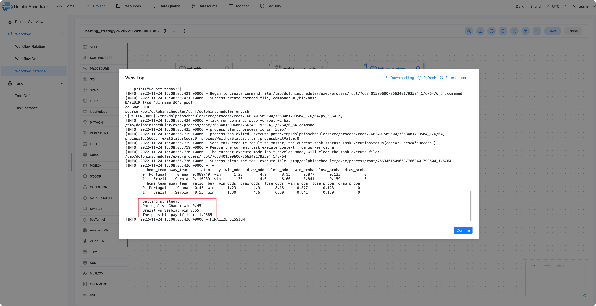

# FIFA-World-Cup-2022

DolphinScheduler machine learning "FIFA World Cup 2022" betting workflow

**YouTube**: [Predict FIFA World Cup 2022 champion and get a daily betting strategy by DolphinScheduler!](https://www.youtube.com/watch?v=pXBINJR2l5Y)

In this project, we will use machine learning to **predict which country will win the FIFA World Cup 2022** and **get a betting strategy every day**.


## World Cup predictions

**Here are the results of two different forecasting methods**

### Simulate 1000 World Cup qualification results based on team win probability

Probability of championship

```
Brazil       0.193
Argentina    0.160
France       0.140
Spain        0.137
England      0.131

```

The top four

```
No.1: Brazil
No.2: France
No.3: Argentina
No.4: Belgium

```

### Choose the team with a high probability of winning

```
No.1: Argentina
No.2: France
No.3: Spain
No.4: Belgium
```

All competition results can be viewed in the following two files

https://github.com/jieguangzhou/FIFA-World-Cup-2022/blob/workflow-pro/results/predict.txt

>  The above results are from the branch `workflow-pro`. This branch will train longer models and run more simulations


## Building a prediction system in three steps

### Step-1 start DolphinScheduler

we can start a [Dolphinscheduler](https://dolphinscheduler.apache.org) standalone server using Docker

```shell
docker run --name dolphinscheduler-standalone-server -p 12345:12345 -p 25333:25333 -d jalonzjg/dolphinscheduler-fifa
```

And then, you can log in to the DolphinScheduler at http://localhost:12345/dolphinscheduler/ui

user: admin
password: dolphinscheduler123



### Step-2 submit workflow

```shell
python3 -m pip install apache-dolphinscheduler==3.1.1
```

```shell
export PYDS_HOME=./
python3 pyds.py
```


You can click the `Project` -> `FIFA`




Then, we can see 3 workflow

- training: Use FLAML to train model
- predict: Use the model to predict which country will win the World Cup
- betting-strategy: Get betting strategy every day




### Step-3 run workflow

#### start training workflow




We can view log after the workflow had finished




#### Start predict workflow

We can view log after the workflow had finished




#### Start betting strategy workflow




`$[yyyy-MM-dd]`mean dolphinscheduler will use  the current year, month and day as a parameter, we can also set it to `2022-12-01` or other date.





## Some Notes

- Can not download data in `download_data` task, please check [Can not access data in some region](https://github.com/jieguangzhou/FIFA-World-Cup-2022/issues/1)

- [Can not see task status](https://github.com/jieguangzhou/FIFA-World-Cup-2022/issues/3)

- [get_odds task error](https://github.com/jieguangzhou/FIFA-World-Cup-2022/issues/4)
